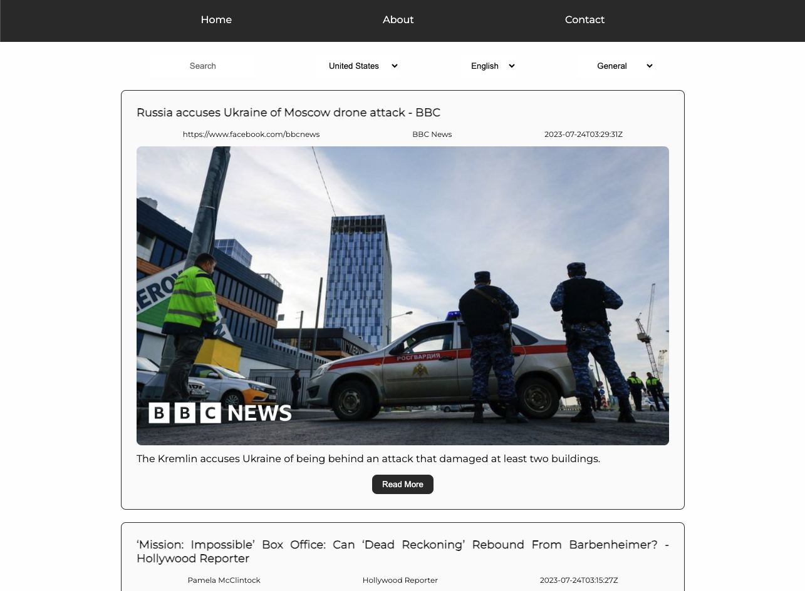

# **News App API**

## _React news app using the API from [newsapi.org](newsapi.org)_

### NPM packages:

- React
  - Used to create fast loading single page sites, which are organised into managable components.
  - Main.jsx : `import react from 'react'`
- React DOM
  - Used to interact with the DOM (Document Object Model)
  - Main.jsx : `import ReactDOM from 'react-dom/client'`
- React router DOM
  - Used to Used to navigate between pages and components.
  - App.jsx : `import { HashRouter, Routes, Route } from 'react-router-dom'`
- React loader spinner

  - show a cool spinning thing while the site loads
  - Homepage.jsx : `import { Puff } from 'react-loader-spinner'`

  ```
  {loading ? (
      <Puff color="#00BFFF" height={100} width={100}/>
      ) : news.length === 0 ? (<p>No Articles Found</p>)` :
      ()}
  ```

  

Ciaran's instructions
:pinched_fingers::call_me_hand::palms_up_together:

> Project Description
> List of npm packages and why we used them
> 2 x code snippet - one of the dynamic api call and one for context - write your understanding of how these work in the app
> Link to NewsApi.org
> 3 emojis
> Different heading and text styles
> Place a quote in quotation marks - can be you favourite or news related
> Display Image
